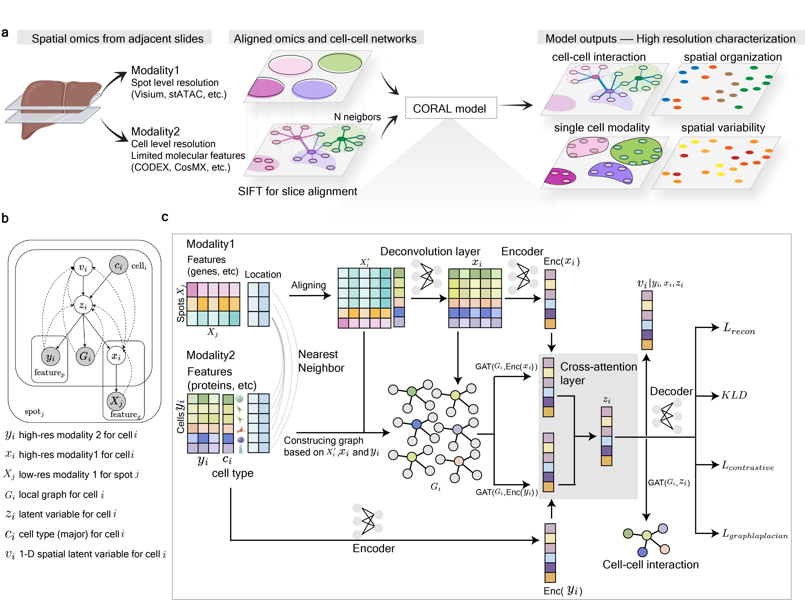

 CORAL
===

**Multi-scale, Multi-modal Integration of Spatial Omics via Deep Generative Model**

[](https://www.python.org/)
[](LICENSE)

---

## Overview

CORAL is a probabilistic, graph-based deep generative model for integrating diverse spatial omics datasets that differ in resolution and detected features. Given two unmatched spatial omics modalities, CORAL:

- Generates **joint single-cell embeddings** informed by both data modalities
- **Deconvolves** the lower-resolution modality to infer molecular profiles at single-cell resolution
- Predicts **cell-cell interactions** between neighboring cells
- Identifies **spatial niches** and predicts spatial variables



## Supported Data Modalities

CORAL accepts a wide range of spatial omics technologies, including:

| Modality | Examples |
|---|---|
| Spatial transcriptomics | MERFISH, seqFISH, Visium, SLIDE-seq, etc. |
| Spatial proteomics | CODEX, MIBI, IMC, etc. |
| Spatial metabolomics | MALDI, DESI, etc. |
| Spatial epigenomics | spatial ATAC-seq |

## Installation

Install CORAL directly from GitHub:

```bash
pip install git+https://github.com/zou-group/CORAL
```

### Setting up the environment

A full conda environment specification is provided in `environment.yml`. To reproduce the environment:

```bash
conda env create -f environment.yml
conda activate coral_env
```

Key dependencies include PyTorch, PyTorch Geometric, scanpy/anndata, scikit-learn, and OpenCV.

## Quick Start

### Input Data

CORAL takes spatial omics data in **AnnData (h5ad)** format:

| Input | Required | Description |
|---|---|---|
| High-resolution AnnData | Yes | e.g., single-cell resolution spatial transcriptomics |
| Low-resolution AnnData | Yes | e.g., spot-level spatial proteomics or metabolomics |
| Cell type annotations | Optional | Major cell type labels on the high-resolution data |
| Ground truth AnnData | Optional | For benchmarking and validation |

### Core Workflow

```python
import coral

# Step 1: Preprocess and align the two modalities
combined_expr, hires_coords, one_hot_cell_types, spot_indices, lowres_expr = \
    coral.utils.preprocess_data(lowres_adata, hires_adata)

# Step 2: Build local subgraphs for message passing
dataloader = coral.utils.prepare_local_subgraphs(
    combined_expr, hires_coords, one_hot_cell_types,
    spot_indices, lowres_expr, n_neighbors=40
)

# Step 3: Create the CORAL model
model, optimizer = coral.model.create_model(
    lowres_dim=lowres_adata.shape[1],
    hires_dim=hires_adata.shape[1],
    lowres_size=lowres_adata.shape[0],
    hires_size=hires_adata.shape[0],
    cell_type_dim=one_hot_cell_types.shape[1],
    latent_dim=64,
    hidden_channels=128,
    v_dim=1,
)

# Step 4: Train
coral.trainer.train_model(model, optimizer, dataloader, epochs=100, device=device)

# Step 5: Generate predictions and validate
adata_model_gener = coral.inference.generate_and_validate(
    model, dataloader, device, hires_adata
)
```

## Tutorials

| Tutorial | Description |
|---|---|
| [Slide Alignment](https://github.com/zou-group/CORAL/blob/main/align_slides.ipynb) | Semi-automated alignment of spatial multi-omics slides using SIFT |
| [Basic Tutorial](https://github.com/zou-group/CORAL/blob/main/coral_tutorial_basic.ipynb) | End-to-end walkthrough after data preparation |

> **Note:** If your spatial multi-omics datasets are not pre-aligned, start with the slide alignment tutorial before running CORAL.

For scripts to reproduce all results in the paper, see the [CORAL reproducibility repository](https://github.com/siyuh/CORAL_reproducibility).

## Key Features

- **Scale-invariant feature transform (SIFT)** for semi-automated alignment of adjacent tissue slides
- **Joint single-cell embeddings** that integrate information across modalities and resolutions
- **Deconvolution** of low-resolution modalities to single-cell resolution
- **Spatial niche inference** from integrated embeddings
- **Spatial variable prediction** across tissue regions
- **Cell-cell interaction prediction** between neighboring cells

## Citation

If you use CORAL in your research, please cite:

```
He, S. et al. CORAL: Multi-scale Multi-modal integration of Spatial Omics via Deep Generative Model.
bioRxiv (2025). https://doi.org/10.1101/2025.02.01.636038
```

## Contact

We welcome questions, feedback, and contributions!

- **Siyu He** — [siyuhe@stanford.edu](mailto:siyuhe@stanford.edu)
- Open an issue on [GitHub Issues](https://github.com/zou-group/CORAL/issues)

## License

This project is licensed under the [BSD 3-Clause License](LICENSE).
