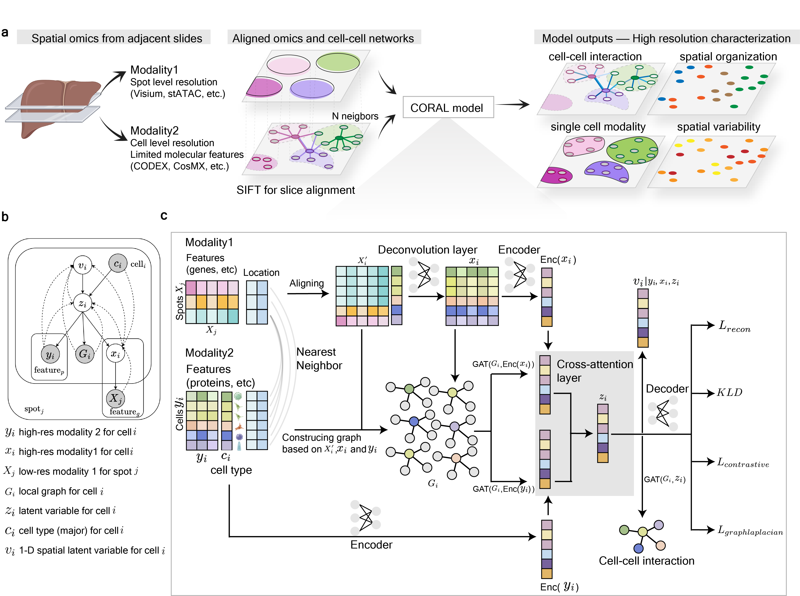

CORAL
=====

**Multi-scale, Multi-modal Integration of Spatial Omics via Deep Generative Model**

CORAL is a probabilistic, graph-based deep generative model for integrating diverse spatial omics datasets that differ in resolution and detected features. Given two unmatched spatial omics modalities, CORAL:

- Generates **joint single-cell embeddings** informed by both data modalities
- **Deconvolves** the lower-resolution modality to infer molecular profiles at single-cell resolution
- Predicts **cell-cell interactions** between neighboring cells
- Identifies **spatial niches** and predicts spatial variables

Supported Data Modalities
--------------------------

.. list-table::
   :header-rows: 1

   * - Modality
     - Examples
   * - Spatial transcriptomics
     - MERFISH, seqFISH, Visium, SLIDE-seq
   * - Spatial proteomics
     - CODEX, MIBI, IMC
   * - Spatial metabolomics
     - MALDI, DESI
   * - Spatial epigenomics
     - spatial ATAC-seq

.. toctree::
   :maxdepth: 2
   :caption: Contents

   installation
   tutorials/index
   api/index

Citation
--------

If you use CORAL in your research, please cite::

   He, S. et al. CORAL: Multi-scale Multi-modal integration of Spatial Omics
   via Deep Generative Model. bioRxiv (2025).
   https://doi.org/10.1101/2025.02.01.636038
